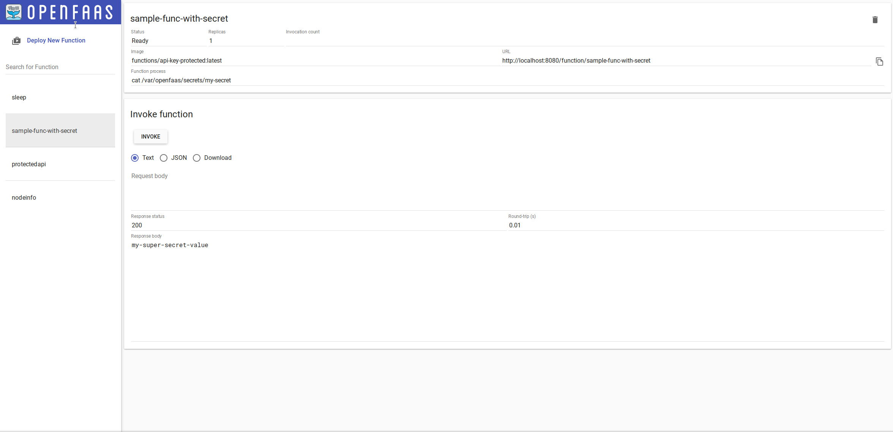

Proudly made by [NeuroForge](https://neuroforge.de/) in Bayreuth, Germany.
# nf-faas-docker-stack

Modernized Docker Stack sample deployment for OpenFaaS with resurrected support for Docker Swarm.

Uses https://github.com/neuroforgede/nf-faas-docker as the provider.

Contributions welcome.
# Used Software (for deployment)

- Docker Stack Deploy Wrapper from here: https://github.com/neuroforgede/docker-stack-deploy

# Showcase

# Status

Experimental, but works locally. Contributions welcome.